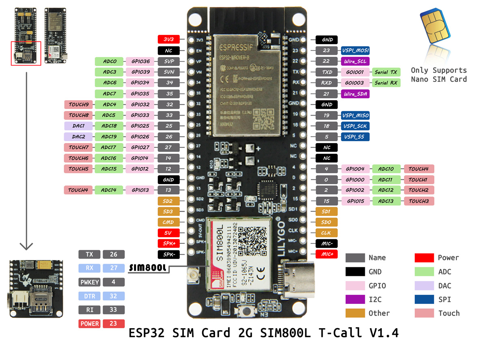
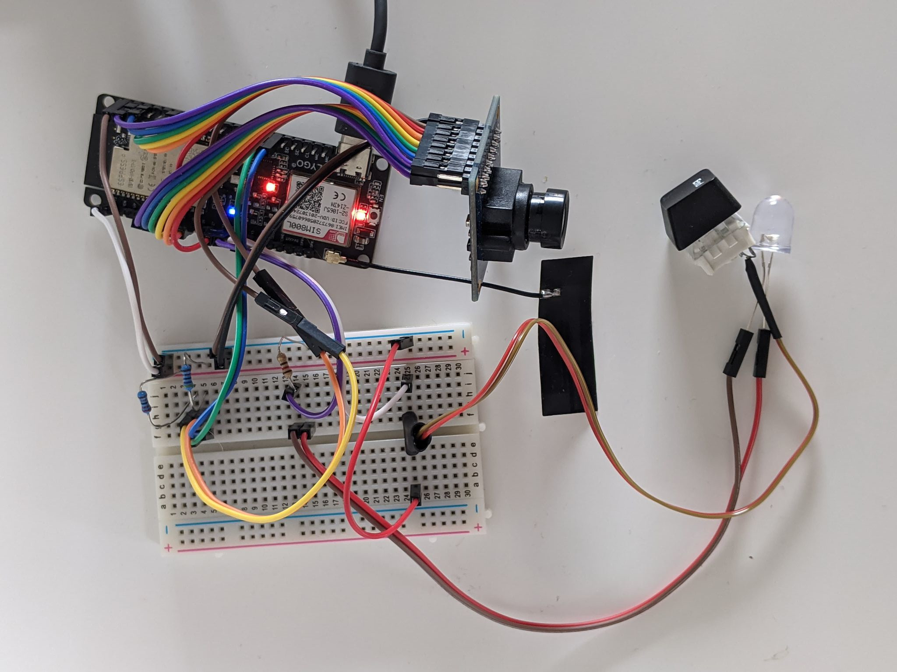

# Hardware

This document details how to put together your own CameraThing, without a GPS featherwing (see the footnotes of [FIRMWARE.md](./FIRMWARE.md) for why).

You'll then need to read [FIRMWARE.md](./FIRMWARE.md) to transform it from a pile of buttons and wires into an actual CameraThing.

## Ingredients

To make one CameraThing you will need:

- A TTGO T-Call V1.4; an ESP32 board with a SIM800L module on it.
- An OV7670 camera module.
- Two 4.7k resistors.
- A button.
- An LED. It doesn't have to be a comically large pink one, but this is preferred.
- A 230 ohm resistor.
- A breadboard (I used a small one with 30 rows and 10 columns, split down the middle, a-e & f-j).
- A lot of jumper wires (preferably some of them still stuck together to use for the camera).

## Recipe

Here is precisely how I did it, you can set up your breadboard differently or use different GPIO pins if you want to rearrange things. There is a picture in the [Example Image](#example-image) section of this document.

1. Jump the TTGO's 3.3v and ground pins to the +ve and -ve rails on your breadboard respectively.
2. Wire up your button:
   1. Jump GPIO pin 12 to 25i on the breadboard.
   2. Insert your button between 25e and 25f on the breadboard.
   3. Jump 25a on the breadboard to ground.
3. Wire up your LED:
   1. Jump GPIO pin 13 to 14j on the breadboard.
   2. Insert your LED's +ve and -ve legs into 14f and 15f on your breadboard respectively (in the picture below, I used jumper wires as extensions so I could have the LED mounted on the CameraThing's box).
   3. Insert your 230 ohm resistor between 15j and the -ve rail on the breadboard.
4. Wire up your camera (I recommend having jumper cables that are still all stuck together, so you can have two separate ribbons of 8 jumper wires coming out of the camera module and then split them as you need to wire them up to the TTGO).
   1. Follow the pinouts described in the [pinout](#pinout) section below, with the exception of the SIOD and SIOC pins.
   2. Jump your SIOC and SIOD pins from the camera to 4f and 5f on the breadboard. 
   3. Insert a 4.7k resistor between 4j and the +ve rail.
   4. Insert a 4.7k resistor between 5j and the +ve rail.
   5. Jump 4h and 5h to GPIO pins 15 and 2 respectively.
   6. Jump the 3.3v pin on the camera to the +ve rail.
   7. Jump the ground pin on the camera to the -ve rail.

I then took the resultant bundle of wires and stuck it inside a cardboard box with a battery bank.

## Pinout

The full pinout I used on my CameraThing is as follows:

| Pin  | Usage             |
| ---- | ----------------- |
| 0    | OV7670 VSYNC      |
| 2    | OV7670 SIOD       |
| 4    | SIM800L Power Key |
| 5    | SIM800L Reset Key |
| 12   | Shutter Button    |
| 13   | Indicator Light   |
| 14   | OV7670 HREF       |
| 15   | OV7670 SIOC       |
| 18   | OV7670 PCLK       |
| 19   | OV7670 D7         |
| 21   | OV7670 D5         |
| 22   | OV7670 D3         |
| 23   | OV7670 D1         |
| 25   | OV7670 XCLK       |
| 26   | SIM800L RX        |
| 27   | SIM800L TX        |
| 32   | OV7670 D4         |
| 33   | OV7670 D6         |
| 34   | OV7670 D0         |
| 35   | OV7670 D2         |

Here's the pinout of the TTGO T-Call V1.4 sourced from the [LILYGO product page](http://www.lilygo.cn/prod_view.aspx?Id=1127):

## Image

**Note:** The TTGO T-CALL was too wide to fit on both of the breadboards i had. I realise as writing this that I could have just put two breadboards next to each other, but everyone's an expert in hindsight.