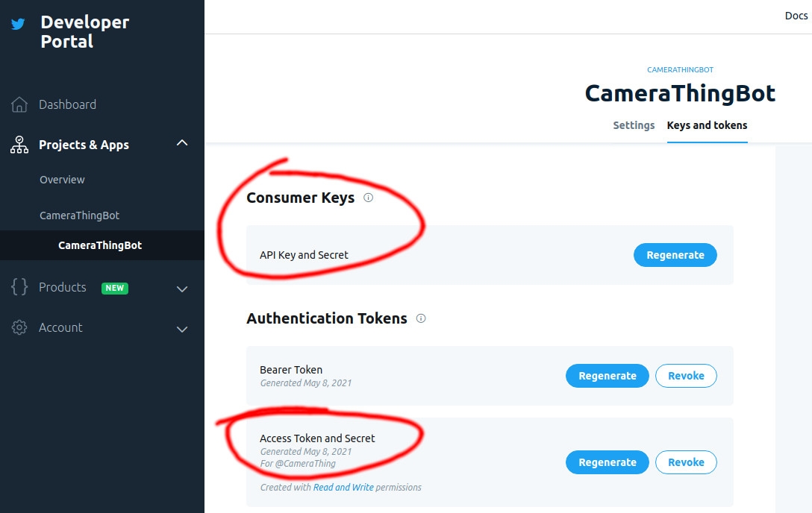

# Tweeter

The tweeter is a service which is intended to run alongside an instance of [go-tensorflow-image-recognition](https://github.com/tinrab/go-tensorflow-image-recognition/). Its purpose is to take images from the CameraThing and create tweets from them on the CameraThing's twitter account. 

The tweeter also currently does some small image post-processing; it upscales the image from the CameraThing without interpolation to be 1280px wide without any interpolation so when people look at the images on twitter, their phones don't attempt to interpolate and make the images look all blurry - I think the hard edges between pixels look funnier.


## Development and Deployment

Development and deployment are documented in the `README.md` at the root of this project as the tweeter is a service intended to run alongside an instance of `go-tensorflow-image-recognition`.


## API

### /health

A `GET` request should be made to this endpoint.

The purpose of this endpoint is to return a response that reads `I'm Healthy!`, which is useful for the CameraThing to be able to check it has an internet connection, and just generally checking that the tweeter service is accessible on the web.

```bash
curl "localhost:8080/health"
"I'm healthy!"
```


### /tweet

A `POST` request should be made to this endpoint with:

- A multipart request body consisting of an image encoded as bytes with the key `image`,
- A `GET` parameter, `auth`, the auth token specified by the [`TWEET_AUTH_TOKEN` environment variable](#TWEET_AUTH_TOKEN).
- Either both, or neither of the following `GET` parameters (providing just one will return a `400` error):
  - `long`, the longitude of the CameraThing where the image was taken.
  - `lat`, the latitude of the CameraThing where the image was taken.

For example, the following curl request:

```bash
curl "localhost:8080/tweet?auth=dev&lat=53.36097329965131&long=-1.6899902029658576" -F 'image=@./cat7.jpg'
{"Tweet":"Mongoose? Wombat? Wallaby? Weasel? Chesapeake Bay Retriever? (53.36097,-1.68999)","TweetURL":"https://twitter.com/CameraThing/status/1394257828580372480"}
```

Or without geolocation:

```bash
curl "localhost:8080/tweet?auth=dev" -F 'image=@./cat7.jpg'
{"Tweet":"Mongoose? Wombat? Wallaby? Weasel? Chesapeake Bay Retriever?","TweetURL":"https://twitter.com/CameraThing/status/1394258066116390915"}
```

The response contains the text used in the tweet created for that image, and the url to the tweet that was created. The request may take a while as the image is processed by [go-tensorflow-image-recognition](https://github.com/tinrab/go-tensorflow-image-recognition/) to create the tweet body, and post processed before the client can be responded to. The server does not return early so that the device can display if uploading a tweet failed for any reason, even server-side, and potentially perform some action with the tweet data (e.g. send a text containing a link to the tweet).


## Environment Variables

### `ENV`

Should be set to either `DEV` or `PROD`. `DEV` allows for the rest of the environment variables to be left unset, default values will be used instead.


### `RECOGNISER_ENDPOINT`

Should be set to the address and endpoint where the tweeter can access the `/recognize` endpoint of an instance of [go-tensorflow-image-recognition](https://github.com/tinrab/go-tensorflow-image-recognition/).

If this is not set, and `ENV` is set to `DEV`, it defaults to `http://imagerec:8080/recognize`.


### `TWEET_AUTH_TOKEN`

Should be set to an alphanumeric randomly generated token which must be provided as a GET parameter to the tweeter's `/tweet` endpoint in order to authenticate - it is a shared secret between the CameraThing and the Tweeter service.

If this is not set, and `ENV` is set to `DEV`, it defaults to `dev`.


### `TWITTER_`

These environment variables all contain credentials to access the twitter API. They can be found in the Developer Portal under Projects and Apps -> Your Project -> Your App -> Keys and tokens:



#### `TWITTER_ACCESS_TOKEN`

Your Twitter Access Token.

#### `TWITTER_ACCESS_TOKEN_SECRET`

Your Twitter Access Secret.

#### `TWITTER_CONSUMER_KEY`

Your Twitter Consumer Key.

#### `TWITTER_CONSUMER_SECRET`

Your Twitter Consumer Secret.


### Example Setups

#### Development

```
ENV=DEV
```

#### Production

```
ENV=PROD
RECOGNISER_ENDPOINT=http://imagerec:8080/recognize
TWEET_AUTH_TOKEN=A random key of your choosing
TWITTER_CONSUMER_KEY=...
TWITTER_CONSUMER_SECRET=...
TWITTER_ACCESS_TOKEN=...
TWITTER_ACCESS_TOKEN_SECRET=...
```

